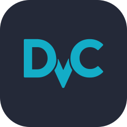
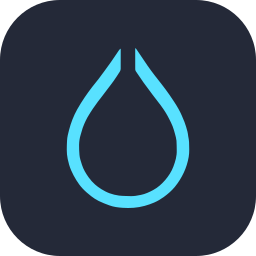

  

 

 

&nbsp;

&nbsp;

&nbsp;

  

  

## Hii, I'm Divya ⊹ ˖
Welcome to my profilee ˖Ი𐑼⋆
I'm a software dev that works in a wide range of sectors that interest me like machine-learning infrastructure, real-time applications, Linux systems and environmental and societal impact-focused technology. My projects range from full-stack platforms and MLOps pipelines to marine monitoring systems, sustainability applications and customized computing environments. Problems where technology connects to environmental issues, real-world infrastructure, and helping my society to reach meaningful outcomes draw my attention the most.

  

  

## Current Work

### Oceanographic System for Coral Reefs: Preservation and Resttoration Project

An MLOps-driven sonar framework for coral reef habitat prediction, marine ecosystem monitoring and restoration decision support. ݁

**Core capabilities**

- Reef-health classification and restoration suitability prediction
- Full MLOps pipeline with experiment tracking, model registry and drift monitoring
- Automated training pipelines using DVC and GitHub Actions
- FastAPI prediction API with Streamlit monitoring dashboard

**Stack** &nbsp;—&nbsp; `Python` `FastAPI` `MLflow` `DVC` `Docker` `Streamlit` `GitHub Actions` `Scikit-learn` `XGBoost`

---

## Featured Repositories

**EcoSphere** — `Sustainability Technology · Full-Stack Engineering · Gamification` — ESG management platform with employee gamification built on a React and NestJS architecture. `React` `TypeScript` `Material UI` `NestJS` `PostgreSQL` `Prisma`

**Real-Time Public Transport Tracker** — `Real-Time Systems · Geospatial Interfaces · Backend Communication` — Live vehicle positions, route visualization and estimated arrivals for small-city transit networks. `JavaScript` `Node.js` `Express` `Socket.IO` `Leaflet`

**Vert Tiger Hyprland** — `Linux Systems · Desktop Customization · Shell and UI Engineering` — Customized Arch Linux environment with Hyprland tiling compositor and a complete dotfile configuration. `Arch Linux` `Hyprland` `Waybar` `Kitty` `Zsh` `CSS`

  

## Technology Stack

<h3 align="center">Languages &amp; Tools I've Worked With</h3>

 
&nbsp;&nbsp;
 
&nbsp;&nbsp;&nbsp;&nbsp;

<h3 align="center">Tech Stack</h3>

**Programming** &nbsp;&nbsp;         

**Application & Backend Engineering** &nbsp;&nbsp;          

**AI, ML & Data Science** &nbsp;&nbsp;             

**MLOps & Data** &nbsp;&nbsp;        

**Infrastructure & Engineering** &nbsp;&nbsp;          

**Linux & Systems** &nbsp;&nbsp;          

---

## GitHub Analytics

&nbsp;&nbsp;

  

  

 

---

## Engineering Interests

| | |
|:--|:--|
| Software architecture | Machine-learning infrastructure |
| Open-source software | Real-time and distributed systems |
| Linux environments | Sustainability technology |
| Marine monitoring systems | Cybersecurity |
| Human-centered interfaces | Research prototypes |
| Automation and deployment | Hardware-software experimentation |

---

## Current Goals

- [ ] Preparing to apply for Google Summer of Code 2027
- [ ] Contributing more consistently to open-source software
- [ ] Building production-oriented MLOps systems
- [ ] Exploring marine and sustainability technology deeper
- [ ] Developing stronger systems and infrastructure knowledge
- [ ] Creating tools that solve practical problems
- [ ] Improving software architecture and deployment skills
- [ ] Turning research ideas into working prototypes

---

## Open to Collaboration

I am interested in working on:

- Open-source projects across software engineering, MLOps and Linux ecosystems
- Sustainability technology and marine science applications
- Real-time data systems with meaningful pipelines
- Cybersecurity tools and security research
- Research prototypes that need engineering implementation

If you are working on something in these areas, reach out through GitHub.

